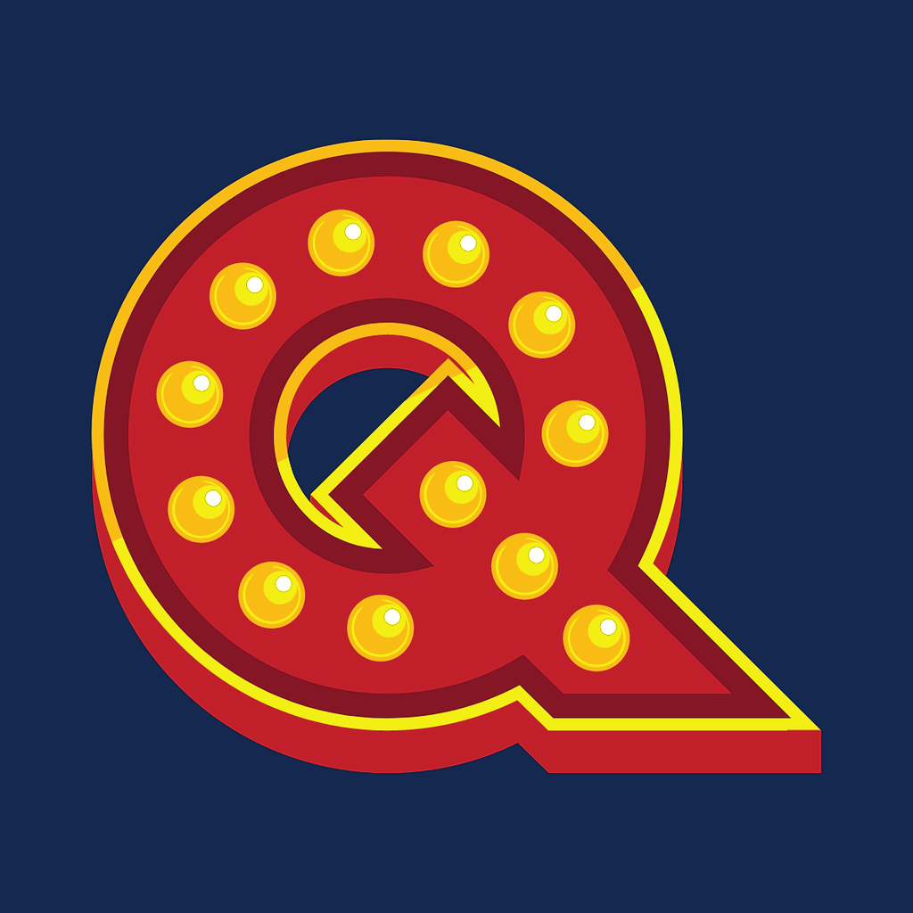
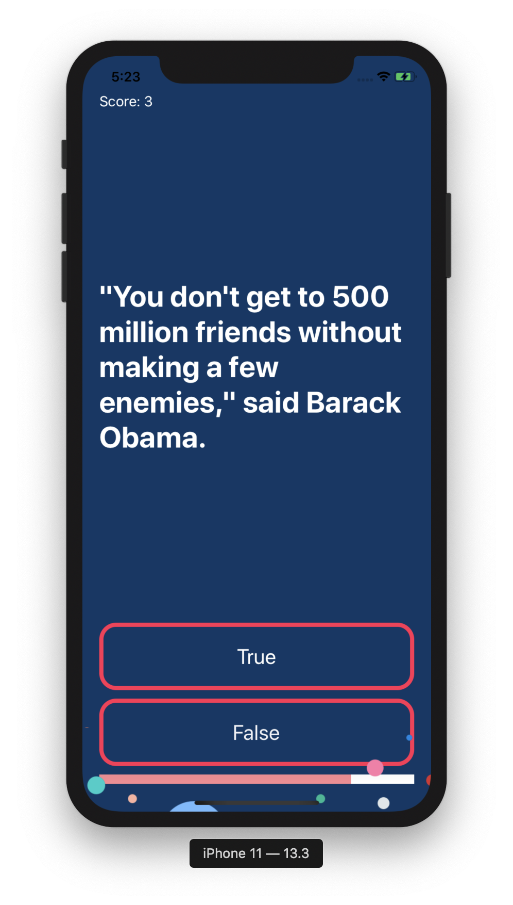

# Quiz-iOS13
A simple iOS Quiz App built on MVC Pattern

The app contains couple of questions where the user has to answer it by True or False, the selected answer will be highlighted by red color if it's false else green if it's true

● Score in which the user can see how many right answers got
● Big Text Question which will be handling questions
● True Button Answer && False Button Answer
● MVC (Model View Controller)
● Progress Bar where the user can see his progress answering to questions
● Background image
● Stack View and Constraints

